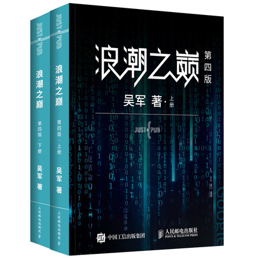

京东：https://item.jd.com/12626736.html

## 第十五章：风险投资

美国的风投一般LP人员较多但不超过500，而国内的风投则相对较少，流程会有所精简。

国内海归创办的三个出名的风投机构是北极光（Northern Light）、华山资本（West Summit）和赛伯乐（Cybernaut）

**在本章吴军老师以量化股权的方式介绍了风投的过程，这对创业者和初入行业的投资者都很有帮助**

风投的估价过程也非常值得学习：比如软件前三名的市场份额是60%、20%和10%。好的项目一定要有数十亿美元的前景，没有10亿美元的市场不要找红杉资本

风投必须要高回报，红杉资本一期的10亿美元仅有Google成功了，但是如果Google的回报率在100以下，总体还是会亏损的

一个好题目必须有以下要点：①这 个 项 目 一 旦 做 成 , 要 有 现 成 的 市 场 ， 而 且 容 易 横 向 扩 展 （Leverage）；②今后的商业发展在较长时间内会以几何级数增长；③必须具有革命性，比如Paypal的支付模式

威廉·德雷帕(William Draper）提出风投就是投人，好的领导者能够适应变化做出关键选择

创始人要和风投搞好关系，哪怕最后创业失败了，风投储备那么多家公司也可以让你去帮忙经营

有一些出名的风投机构，比如：

- ① 红杉资本。括苹果、Google、思科、甲骨文、 雅虎、网景（1999年被美国在线收购）和YouTube（Google旗下,未上市）等IT 巨头和知名公司。中国区沈南鹏
- ② KPCB，凯鹏华盈成功投资了太阳公司、美国在线、康柏电脑、基因泰克、 Google、eBay、亚马逊（Amazon)和网景等著名公司。但是在中国区没什么成功的项目，看最新的报道也错失了很多机会，发展阶段的基金负责人，号称硅谷女皇的前大摩著名分析师玛丽米克儿也带着团队离开了公司——腾讯科技硅谷封面第14期[硅谷版“权力的游戏”：昔日风投帝国KPCB为何衰落？](https://mp.weixin.qq.com/s/-IGSRGEfPTr4f1j4cAZ6vA)
- ③ 创新工厂的股权占得太高了，而且也创立较早没有上市的企业，但是社会效益不错
- ④ Y3，注重培训辅导，从而投得更准，陆奇之前就是中国区的负责人

B站还有很多风投的采访：[著名风险投资机构访谈录 Sequoia、DCM、GGV、Qiming](https://www.bilibili.com/video/BV1PW411K7Po)、[美国凯鹏华盈（KP）VC基金前任主席 John Doerr 与斯坦福学生问答](https://www.bilibili.com/video/BV1YT4y1w7T6)、[互联网女皇米克尔纵论2018年互联网趋势报告](https://www.bilibili.com/video/BV1gW411A7EJ)、[【A16z】硅谷投资机构访谈](https://www.bilibili.com/video/BV1gW411G72q)

## 第十七章：斯坦福大学

斯坦福1885年才由加州铁路大王斯坦福成立，1951年通过土地出租99年来办学既解决了财务困境又造就了硅谷。

斯坦福大学在专业设置上覆盖了哈佛大学和麻省理工学院的合集，并且斯坦福大学既强调素质教育，又强调专业教育，所以不像MIT的可能就是资深工程师，而且斯坦福离华盛顿远，所以参加国家项目的少，和工业界互动很多，这样能做很多实际的事情而不是迎合政府的要求。

斯坦福对大学教授开公司也很支持，只要能完成教学和科研任务即可。MIT、Berkeley还有Waterloo虽然都采用了厂校结合，但是融合失败，学生做的课题和学校没什么关系，很多学生本科去实习日后并不会进入当时资助他的大公司工作。

斯坦福的商学院也挺厉害的，有8名诺贝尔经济学奖获得者，和哈佛商学院齐名。

**洪堡体制**普鲁士德国的外交家和教育家威 廉·冯·洪堡(Wilhelm von Humboldt)提出将大学从一个教育机构变成了一个教育和研究的综合机构。普鲁士得益于洪堡的高等 教育体系，很快从欧洲一个农业国实现了工业化。中国因此将清华大学、北京大学等原来的综合性大学拆成文理型大学、工科 大学、政法学院和医学院等，美国丹尼尔·吉尔曼（Daniel Gilman)以此创立了约翰霍普金斯。

吴军说：2016年AlphaGo 战胜李世石之后,人工智能在美国大学里很热门，我接触到的斯坦福的学生大 多想利用人工智能赶快做点什么事情，而麻省理工学院的学生则在挑AlphaGo 相比人的不足之处——耗电量太高,训练量太大。这些本身并没有错,做学术研 究是很好的课题,但是对于创业者来 ，需要的是尽快倬用成功的技术，而不 是给它们挑刺。

英国的牧师和教育家约翰·纽曼 (John Henry Newman)说大学是传播“大 行之道”(Universal Knowledge)而不是雕虫小技的地方。今天,包括牛津大学和剑桥大学在内的英国一些大学依然遵循纽曼的这种 理念。牛津大学和剑桥大学的每个学院(College)，比如剑桥大学著名的三一 学院（出过著名科学家牛顿)和国王学院,其实都是由不同学科的学生和单身教 授吃住在一起的生活小区,而不是我们常说的工学院、文学院等专业学院。**纽曼的教育方法要求受教育者有很高的自觉性**。俗话说近朱者赤，近墨者 黑。如果一所大学大部分学生都是问题学生，而学校又不加管束,这所大学一 定办得一团糟。因此很多州立大学，生源参差不齐，很难实施纽曼的这个理 念。

斯坦福大学吸收了两者的特点。他的学生来源非常多样化、多元化，从文理、工程、 医科、商业到法律什么都有。很多人到了斯坦福并不把自己限定在一个专业 上。可以想象，一个计算机博士在和一个住院医生谈论浏览器时，就必须用最 通俗的语言进行交流,而不是对各种技术评头论足。斯坦福的学生还是运动健将，尤其游泳这里经常在奥运会拿金牌。

**南审的书院制就是这种笑话**：大家可能有这样的体会，学习计算机的同学 聚在一起常常谈论一些和计算机或科技有关的话题,学习金融的在一起常常谈 论对经济的看法。如果一所大学都是由同一类年轻人构成,他们取长补短的结 果不过是补充了专业知识，而不是大行之道。麻省理工学院、加州理工学院和 卡内基–梅隆大学等优秀大学易然在工程上不比斯坦福大学差,但是无论是专 业、课程和生源都太单一。

斯坦福的学生创业办公室也做的很好，帮助了Google的佩奇和布林。还有一个非常闻名的风险投资论坛一一斯坦福企业家之角 (Stanford Entrepreneurship Corner）。斯坦福大学鼓励创业的另一项具体措施是对利用职务发明创业的宽容，大学所占的股份也不是很多。

**留学生创业的身份问题**：根据美国移民法律，外国学生在完成学业后，将不再拥 有学生身份（F1签证）。如果不能获得工作签证（H1），那么这些学生最多只 能以实习的身份（Practical Training）在美国再待上一年。而获得工作签证 的前提是被一个雇主（比如公司或者大学）以足够高的薪水雇佣。这样外国学 生一毕业直接创业就会面临身份问题。斯坦福愿意帮助学生延毕来获得合法身份，为创业形成良性循环。

**大学生创业**：很多人认为商学院的学生就应该热衷于创业，其实不然。虽然很多商 学院为学生营造了各种创业条件，但是他们创业成功的案例还不如学习工程的 学生多。专门扶持创业的学校里的很多学 生们都为了完成学业，挖空心思想出来的项目，与太阳的工作站、思科的路由 器、雅虎的网站和Google的搜索引擎这些源于创业者科研实践的项目完全不 同。

B站还有吴军老师对教育的采访视频[父母的高度才是孩子的起跑线【锵锵三人行】吴军 李菁](https://www.bilibili.com/video/BV1ov411G7T6)，吴军提到MIT的女儿说现在年轻人不在乎学什么了，而是和大师学，学他的思维，因为大学的很多知识很多用不到工作当中。结合这些看来和工作的感受，国内的教育以及和工业界的配合实在是太弱了。